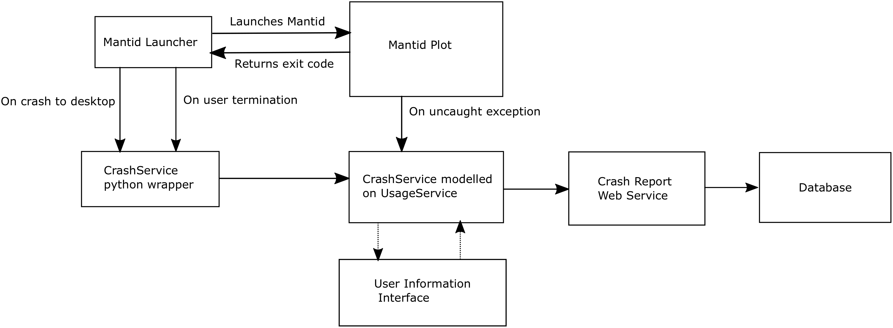

# Crash reporting

## Motivation/Introduction

Stability and reliability are consistently amongst the most desired improvements cited by Mantid users. In order to tackle the issues surrounding the stability and reliability of the current code, we first need to understand *quantitatively* the types of problems that are being encountered by users. 

Currently we have several mechanisms for users to provide details of problems with Mantid. These include the online forum ([http://forum.mantidproject.org/](http://forum.mantidproject.org/)), users meetings and direct correspondence between developers and users. These can, at best, be described as semi-quantitative.

To obtain truly quantitative information about Mantid issues, we intend to implement a crash reporting system. The reporting system is intended to allow users to report details of encountered issues, with minimal friction and to collate the information in a centralised, structured location, facilitating analysis and ultimately enabling informed development decisions. 

The key information that we want to capture is:

* Frequency of issues
* Types of issues
* As much information about causes of the issues as possible

Concerns that we need to bear in mind are:

* Data security/privacy
* B
* C

## Timescales

We would like to have an initial version of the "Crash Reporter" in the next release of Mantid. Although it is unlikely to be possible to include all desired functionality by this time, we are confident that a level of crash reporting will be possible which should allow us to assess certain metrics, such as crash frequency. Further details are outlined in the 'Requirements' section.

## Requirments

#### Necessity

* M : Mandatory
* D : Desirable
* O : Optional

The "Desirable" necessity is something which might not get addressed in the
the very first iteration of the the implementation, but should eventually be
provided.

### High Level Requirments

#### Functional requirments

 Label  | Requirement    |   Necessity |
|--------|----------------|-------------|
| R.1.1  | Uncaught exceptions are reported back as crashes  | M |
| R.1.2  | User hard terminations i.e. via task manager are reported as crashes | M |
| R.1.3  | Catastrophic failures are reported back as crashes | M |
| R.1.4  | Stores crash reports in an SQL database | M|
| R.1.5  | Where possible asks the user for further information about crash | D|
| R.1.5  | Sends the textdump of the log file along with the crash report | D|

#### Non-functional requirments 
Label  | Requirement    |   Necessity |
|--------|----------------|-------------|
| R.3.1  | Must comply with mantids stated privacy policy | M |
| R.3.2  | Must be forward compatible with the mantid workbench | M |

## Design

### Overview

The two major segments that need to be implemented in order to report crashes are a method to detect when Mantid has crashed and an implementation to then report these crashes. 

#### Crash detection
There are three major sorts of crashes which we wish to report with the handler.  

##### 1. Uncaught exceptions

 These occur when an exception propagates all the way up to the last chance error handler. Whilst it is possible to continue using Mantid after this the uncertain state of the system means that it is not recommended so it is treated like a crash.
Detecting this sort of crash is already done as they are caught by the last chance exception handler so we just need to call whatever code we implement to report the crashes from there. 

##### 2. Mantid unresponsive 

It has been assumed that when Mantid is unresponsive it will be manually terminated by the user. In windows for example they might use task manager. This cannot be detected from within Mantid so it has been decided to implement an external launcher which can check how Mantid exits and if necessary call the crash reporting. This may lead to some false positives as users terminate Mantid unnecessarily but this level of noise in the reporting has been deemed acceptable.

##### 3. Crash to desktop

This will be detected in a similar way to the Mantid unresponsive case in that an external launcher will make note of how Mantid exits and if necessary call the crash reporter.  

##### Mantid Launcher

The Mantid Launcher should be lightweight and invisible to the user. On Windows and Linux Mantid is already launched via a batch and bash script respectively which can be extended upon to fulfill this purpose. 

Preliminary testing on windows shows Mantid obeying the following exit code structure.

Situation  | Exit Code   |  
|--------|----------------|
| Exited without error  | 0 | 
| Force terminated  | 1 |
| Crash to Desktop  | Varies but not so far 0 or 1|

It should therefore be feasible to check the exit status of mantidplot and if necessary call the crash reporting implementation from within these scripts. A difficultly to keep in mind here however is that the crash reporting implementation in this instance needs to be called from outside Mantid.

#### Crash Reporting
Once a crash has been detected it needs to be reported  there are several requirements and design constraints which this reporting system needs to meet. 

The most important of these is R.1.4 which requires that the crash reports are written out to a database. This can be achieved in a similar way to the method currently used to report on usage in UsageService.cpp. They can be stored in the same database as the existing usage reports but go to a different url to allow some flexibility in how the crash reports are handled. The suggested url is "http://reports.mantidproject.org/api/crash". The api on the mantidproject website will need to be modified to accommodate this but this should be feasible. 

The largest design constraint upon this system is that it has to be callable from outside Mantid. The easiest way to achieve this is to expose it to mantidpython which can then be called from within the launcher scripts without relaunching mantidplot. 

