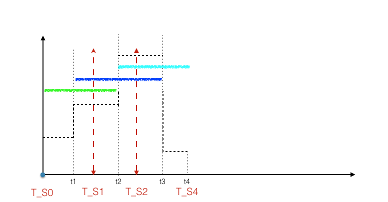
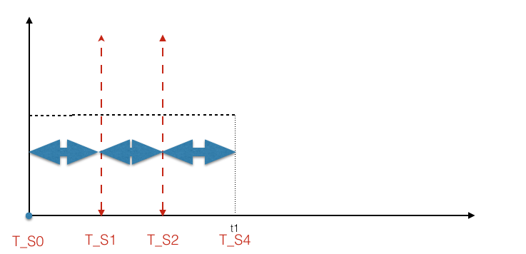

# Splitting TimeSeriesProperty

Assume that a TimeSeriesProperty `P` has entries (t\_0, v\_0), (t\_1, v\_1), ..., (t\_n, v\_n).
It is split by a set of (N-1) splitters, (T\_0, T\_1, w\_0), (T\_1, T\_2, w\_1), ... and (T\_(N-1), T\_N, w\_(N-1)).

## Split TimeSeriesProperty use case 1

In this case, there are more than 1 entry of TimeSeriesPrperty `P` between the start and stop time of a splitter i, i..e,  T\_(i-1), and T\_i, respectively. 
And The split entries will be written to a new TimeSeriesProperty indexed as w\_(i-1)).
Then in `P`, it can be found an entry j and and entry k, where j < k, such that
t\_(j-1) <= T\_(i-1) < t\_j, and t\_(k-1) < T\_i <= t\_k.
The split-out TimeSeriresProperty by this splitter shall contain the entries as (t\_(j-1), t\_j, ..., t\_k),
which will be written to output TimeSeriesProperty indexed as w\_(i-1).

## Split TimeSeriesProperty use case 2

In this case, there are more than 1 consecutive splitters within an entry j of `P`.
Such that t\_j < T\_i < T\_(i+s+1) < t\_(j+1), where s is the number of splitters within entry j.
Then no splitting is required to `P`'s j entry in this situation.

## Special case: Proton charge

The sum of split proton charge logs shall be same as the original proton charge. 
The algorithms for use case 1 and 2 are not fit.
