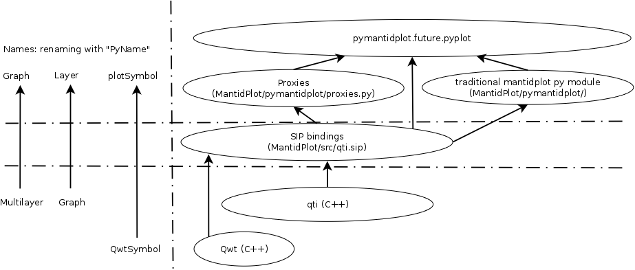

Introduction
============

The python plotting interfaces are based on different components
arranged into (not strictly hiearchical) layers. The purpose of this
short document is to clarify what are those layers and how they
interact.

The layers are a mixture of C++ libraries, Python/C++ bindings, and
python modules:

- Qwt (version 5, as used by the qti version or fork of Mantid)

- qti (Mantid custom version)

- SIP bindings for qti (C++ to Python), defined in
  Code/Mantid/MantidPlot/src/qti.sip

- Python proxies for qti objects, defined in this module:
  Code/Mantid/MantidPlot/pymantidplot/proxies.py

- mantidplot (traditional mantidplotpy or mantidplot.py) Python
  plotting interface: Code/Mantid/MantidPlot/pymantidplot/__init__.py

- Experimental pymantidplot.future Python plotting interface:
  Code/Mantid/MantidPlot/pymantidplot/future/pyplot.py

The two first layers are C++ code whereas the three last ones are
Python code. The layers are not arranged in a strict hiearchy. Qwt is
normally hidden below qti but it is sometimes used directly, for
example when using marker symbols or when you need to access the x-y
values of the lines shown in a plot.

Diagram of layers
=================



The figure shows the different layers used (or dependencies of
future/pyplot. The proxies python module provides thread safety and
management of QObject graphical objects. At the moment future/pyplot
relies on the traditional plotSpectrum, plotBin, etc. functions of the
traditional mantidplot module, but it also uses qti and Qwt
functionality exposed through SIP bindings.

Most relevant classes and methods from qti
==========================================

The proxy classes fulfill two tasks that have to do with Qt
widgets. You should never use qti (Qt) graphical interface
functionality without going through a proxy because they take care of
the following:

- They listen for the QObject 'destroyed' signal and set the wrapped
  reference to None. For example, if the user closes a plot window,
  the proxy objects will be aware that the underlying object has been
  destroyed.

- They ensure that calls to GUI methods are run in the Qt GUI thread
  (and not the python interpreter or any other thread), preventing
  more than likely GUI misbehavior and/or crashes that would occur
  otherwise. See CrossThreadCall.threadsafe_call() in
  pymantidplot.proxies.

Looking at the figure above, the essential objects in the python
modules are the following proxies: Graph, and Layer. Both are proxies,
so you can call Graph and Layer GUI methods safely.

A Graph is a plot, something with axes and lines or colors displayed
on it. And a Graph can include one or more layers (Layer class). In
simple plots you will normally have a single layer, and you will most
often manipulate plot properties througth ```Graph.activeLayer()```.


How mantidplot uses the proxies and SIP bindings of qti
=======================================================

The traditional mantidplot Python interface essentially wraps the main
plot methods of MandtidUI
(http://doxygen.mantidproject.org/d3/db6/classMantidUI.html) and
ApplicationWindow, including plot1D, drawSingleColorFillPlot,
stemPlot, and waterfallPlot. The slice and instrument viewers are used
through two specific proxy classes: SliceViewerProxy,
SliceViewerWindowProxy, and InstrumentWindow.

With the proxy objects you can always check the status of the
underlying (Mantid/qti/Qt) widget like this:

```python
if graph._getHeldObject() == None:
```
With this type of check you can prevent operating on windows or other
objects that have been destroyed (for example closed by the user) and
are no longer valid.

How pymantidplot.future uses the proxies and SIP bindings of qti
================================================================

The aim is to provide a matplotlib-like object oriented model and
functional interface.  This module defines two classes, Line2D and
Figure, meant to resemble the equivalent matplotlib classes. Their
implementation is presently just basic.

Internally, the current implementation of pymantidplot.future relies
on the plotBin, plotSpectrum and plotMD functions of the traditional
mantidplot module (which in turn are wrappers for MantidUI's
plot1D). This is not necesarily the best option but for now it works
and guarantees a behavior very similar to the traditional
interface. However, this module also uses (lower level) methods from
qti (classes Graph and Layer) to manipulate plot properties.

Since some of the plot functions return Line objects, representing the
curves included in the plots. From these lines it is possible to
obtain the x-y values of the plot curves. To support this, the class
QwtData has been exposed in the SIP bindings. The methods size(), x(),
and y() are used to provide the methods get_xdata() and get_ydata() in
mantidplot.future.Line. Currently there are two SIP binding files
exposing different fragments of Qwt:
Mantid/MantidQt/Python/qwttypes.sip, and
Code/Mantid/MantidPlot/src/qti.sip.

As a consequence, in this module you have a mixture of:

- Use of general functions of the traditional mantidplot
- Use of additional methods from qti (manipulation of plot lines and
  properties)
- Use of Qwt functionality

Tips
====

Several classes are renamed in the SIP Python bindings. You will have
to pay special attention to this. The names can be confusing at first,
but luckily there's a one to one correspondence. What is called
'Graph' (a proxy) in Python is called 'Multilayer' in
C++. Graph.activeLayer() gets a C++ Graph object, which in Python is a
'Layer' proxy.

From the Python proxy Graph you can get the topmost layer using the
method activeLayer() (Graph.activeLayer()), which return a proxy of
'Layer' class. Because the C++ Multilayer class is renamed as 'Graph'
in Python, this correspond to the method activeGraph() of the C++
(qti) Multilayer class which return a C++ Graph object
