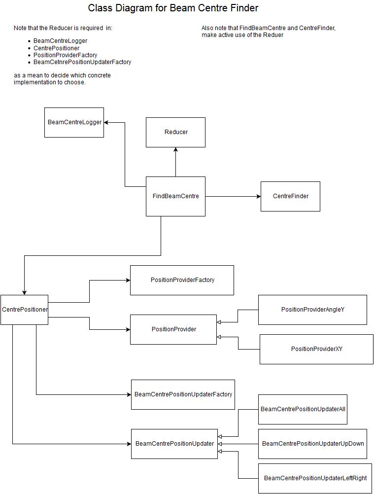
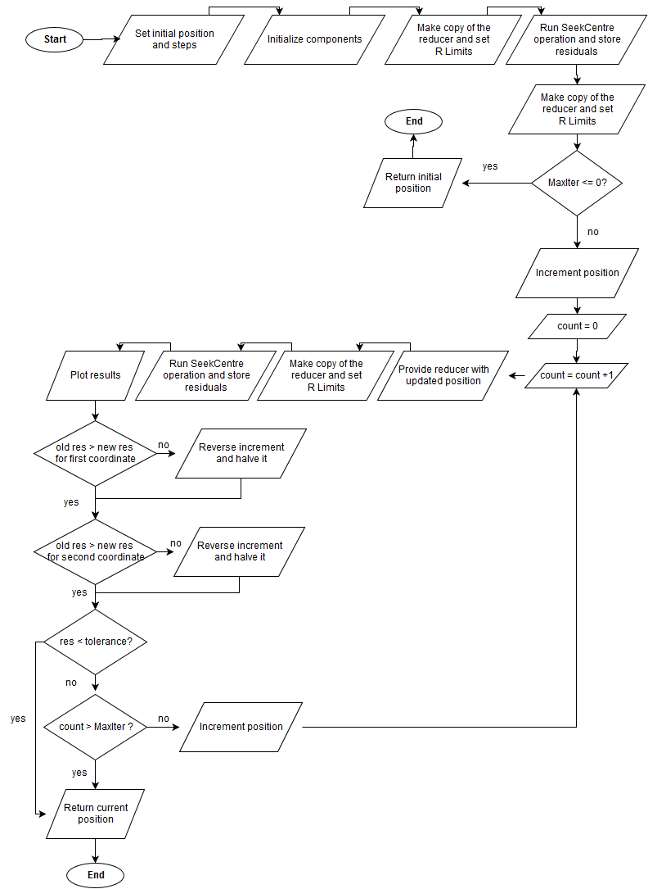
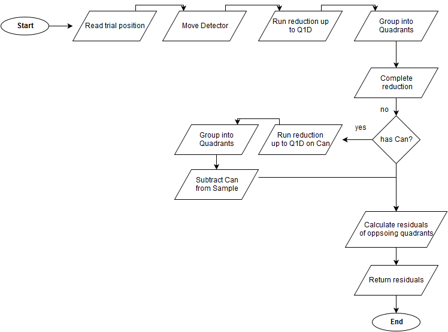

# Design Document for Beam Centre Finder

### Current issue
In order to calibrate the Beam Centre position with respect to the detectors it is needed to perform an accurate extimation of this position. This functionality is provided by a Beam Centre Finder (*BCF*). 

An implementation for this BCF already exists for ISIS SANS. This implementation is heavily tied up with the ISIS instruments and the specific way the data reduction is implemented for ISIS SANS. ANSTO requires the same functionality as the current BCF provides. Unfortunately, it is not possible to directly use the BCF functionality with the ANSTO specific implementation of data reduction.

The different implementation approaches of ISIS and ANSTO are not compatible. The two approaches can be summarized:

* ISIS makes use of a so-called ReductionSingleton which has a series of registered reduction steps. During the reduction, the ReductionSingleton() carries state (mainly via the custom ISIS instrument classes). Intermediate results are stored in the Analysis Data Service (ADS).

* ANSTO's reduction implementation is currently still work in progress, but will eventually make use of so-called Workflow-Algorithms which do not populate the ADS or carry state information. This will be a cleaner, more maintainable implementation which will is easier to test and verify.


This document outines the required changes to make the BCF useable in a more general, faciltity- and instrument-agnostic way.

The benefits of introducing a more general BCF are:

* Avoiding a facility-based implemnetation and having this functionality in a dedicated location will make the BCF much more maintainable and it will be easier to introduce changes which affect all facilities.
* A BCF which does not depend on facility- and instrument-specific should allow for an easy reuse with new instruments and facilities which might join Mantid in the future.
* Removing the dependence of the ReductionSingleton will allow for easier unit testing of the BCF 


The current static details of the implementation can be see here:




The current worflow is illustrated below. It is separated into two parts, one which is repsonsible for the stepping through the parameter space


and one which illustrates how the residuals which are a measure of our search quality. This is achieved by the *SeekCentre* operation:



### Proposed solution
In general terms we want to hide any solution-specific details in the BCF. Currently there is a layer of abstration which hides the instrument specific details, e.g. LARMOR uses an instrument rotation instead of a translation. Extending this abstraction further to make the functionality also facility-agnostic will allow us to apply the BCF to any facility or instrument.

One way of achieving this is a generic interface which is discussed below. In this case each instrument\facility needs to provide an implementation for the generic interface. This implementation is then injected into the BCF. 

Another, similar way, would be to use a Template Method approach. We would have to create a class-based version of the BCF. Each instrument/facility then implements the methods which need to be overwritten.


### Components in the current implementatin which need to be considered

* Bare calls to the ReductionSingleton, eg ReductionSingleton().inst.cen_find_step
* The CentrePositioner which is responsible to provide new positions after each iteration. 
  This abstracts away differences in the way instruments handle displacements(translation or rotation) 
  and also contains takes into left/rigth or up/down or both are desired for BCF operation. Note that the 
  ReductionSingleton() is injected into the CentrePositioner.
* The BeamCenterLogger needs to report on the search operation. It displays coordinates mainly. Note that 
  since we are dealing with m in the logic and mm in the output this is being considered here. Similarly, it 
  handles degree for rotations. It also takes the reducer as an input. Note that the ReductionSingleton() is 
  injected into the BeamCenterLogger.
* CentreFinder is where the reduction takes place and where the residuals are calculated which are the quanitity
  we want to minimize. The CentreFinder itself contains bare references to the ReductionSingleton() itself.

### Elements which are fairly reusable already
* The CentrePositioner and the underlying factories need to be extended to detect when we want to use a different facility. This should not require a major workover. For example, we need to be able to detect that we are dealing with ANSTO data and then switch to a XY-instance for the PositionProvider. This means we have to change the input slightly  to take something more general than a reducer and base our factory decision on this more general input. If the factory chooses an ISIS instrument, we can make use of the current implementation.
* The Beam Centre Logger should be injected and completly replaced by an Ansto implementation. We log into the ISIS SANS GUI currently. Most likely this will be quite different for other facilities.

### Generic interface approach

An abstract base class which can provide a more general interface could look like this
```python
class SANSBeamCentreFinderReduction(abc):
   ...

   @abstractmethod
   def getInitialValues(xstart, ystart)
   '''
   @returns beam coords, steps 
   '''

   @abstractmethod
   def updateInternalCoordinates(coord1, coord2)
   '''
   An update step before to be called before we seek the centre
   '''

   @abstractmethod
   def applyLimits(rlow, rupp)
   '''
   Applies the limits and needs to be done after a Seek step.
   '''

   @abstractmethod
   def getSeekCentreReducer()
   '''
   @returns the wrapper for the appropriate reduction workflow, 
            which itself is an abc
   '''
```

The methods are intended to map to and replace the following parts of the code base:

* initialize -> [intro](https://github.com/mantidproject/mantid/blob/83413fba8602e8b71cd277f7538c689909c975a2/scripts/SANS/ISISCommandInterface.py#L1112:L1134)

* updateInternalCoordinates 

* applyLimits -> [update](https://github.com/mantidproject/mantid/blob/83413fba8602e8b71cd277f7538c689909c975a2/scripts/SANS/ISISCommandInterface.py#L1136:L1138). This is required in several places.

* getSeekCentreReductionWrapper -> [here](https://github.com/mantidproject/mantid/blob/83413fba8602e8b71cd277f7538c689909c975a2/scripts/SANS/ISISCommandInterface.py#L1163) and [here](https://github.com/mantidproject/mantid/blob/83413fba8602e8b71cd277f7538c689909c975a2/scripts/SANS/ISISCommandInterface.py#L1141). This returns an instance of the class which is defined below. This class hides away the details of the implementation of the reduction, ie if a Reducer Singleton with reduction steps or a workflow algorithm approach is used.

-----------------------

``` python
class SANSSeekCentreReduction(abc):
   ...

   @abstractmethod
   def moveInstrument(sign_policy, coord1, coord2)
   '''
   Moves the instrument in the workspace. ISIS will leave this as is
   ANSTO needs to think what the right way of moving is
   '''

   @abstractmethod
   def getWorkspace()
   '''
   Provides the original workspace
   '''

   @abstractmethod
   def getReducedSlices(workspace, ??can_workspace)
   '''
   This takes in a the workspace performs a reduction and provides four slices for UP/DOWN LEF/RIGHT
   @returns 4 1D, sliced workspaces
   '''
   
   @abstractmethod
   def ceanUpSlice(workspace)
   '''
   Removes the EndNans from the workspace
   '''

```

* moveInstrument -> [move](??)

* getReducedSlices -> [slices](??). Produces 4 reduced 1D workspaces. These workspaces are used for the residual calculation.

* ceanUpSlice -> [cleanup](??). Performs a clean up of the slices. We could have this functionality as part of the CentreFinder class


## Example of the altered FindBeamCentre algorithm


``` python
def FindBeamCentre(rlow, rupp, MaxIter = 10, xstart = None, ystart = None, tolerance=1.251e-4, find_direction = FindDirectionEnum.ALL, SANSBeamCentreFinder= SANSBeamCentreFinderImpl(), logger = None):

    # Get initial values for the beam centre and the step size
    beamcoords, coordstep = handler.getInitialValues(xstart, ystart)
    
    # Apply limits
    handler.applyLimits(rlow, rupp) 

    # Create an object which handles the positions and increments
    centre_positioner = CentrePositioner(reducer = handler.SANSSeekCentreReducer(),
                                         position_type = find_direction,
                                         coord1_start = beamcoords[0],
                                         coord2_start = beamcoords[1],
                                         coord1_step = coordstep[0],
                                         coord2_step = coordstep[1],
                                         tolerance = tolerance)

     
    # Produce the initial position
    COORD1NEW, COORD2NEW = centre_positioner.produce_initial_position()

    # Set the CentreFinder
    sign_policy = centre_positioner.produce_sign_policy()
    centre = CentreFinder(reducer = handler.getWorkspace(),
                          sign_policy,
                          find_direction)


    # Produce a logger for this the Beam Centre Finder
    logger.init(centre_reduction,
                coord1_scale_factor,  <-- needs rethinking
                coord2_scale_factor)  <-- needs rethinking


    # this function moves the detector to the beam center positions defined above and
    # returns an estimate of where the beam center is relative to the new center
    resCoord1_old, resCoord2_old = centre.SeekCentre(handler.SANSSeekCentreReducer(),
                                                     [COORD1NEW, COORD2NEW])


    # Apply limits
    handler.applyLimits(rlow, rupp)

    logger.report_status(0, original[0], original[1], resCoord1_old, resCoord2_old)

    # If we have 0 iterations then we should return here. At this point the
    # Left/Right/Up/Down workspaces have been already created by the SeekCentre function.
    if MaxIter <= 0:
        zero_iterations_msg = ("You have selected 0 iterations. The beam centre" +
                               "will be positioned at (" + str(xstart) + ", " + str(ystart) +")")
        beam_center_logger.report(zero_iterations_msg)
        return xstart, ystart

    logger.report_init(COORD1NEW, COORD2NEW)

    # take first trial step
    COORD1NEW, COORD2NEW = centre_positioner.increment_position(COORD1NEW, COORD2NEW)

    graph_handle = None
    it = 0
    for i in range(1, MaxIter+1):
        it = i

        handler.updateInternalCoordinates(COORD1NEW, COORD2NEW)

        resCoord1, resCoord2 = centre.SeekCentre(centre_reduction, [COORD1NEW, COORD2NEW])

        # Apply limits
        handler.applyLimits(rlow, rupp)

        logger.report_status(it, COORD1NEW, COORD2NEW, resCoord1, resCoord2)

        if mantidplot:
            try :
                if not graph_handle:
                    #once we have a plot it will be updated automatically when the workspaces are updated
                    graph_handle = mantidplot.plotSpectrum(centre.QUADS, 0)
                graph_handle.activeLayer().setTitle(\
                         logger.get_status_message(it, COORD1NEW, COORD2NEW, resCoord1, resCoord2))
            except :
                #if plotting is not available it probably means we are running outside a GUI, in which case do everything but don't plot
                pass
        #have we stepped across the y-axis that goes through the beam center?
        if resCoord1 > resCoord1_old:
            # yes with stepped across the middle, reverse direction and half the step size
            centre_positioner.set_new_increment_coord1()
        if resCoord2 > resCoord2_old:
            centre_positioner.set_new_increment_coord2()
        if (centre_positioner.is_increment_coord1_smaller_than_tolerance() and
            centre_positioner.is_increment_coord2_smaller_than_tolerance()):
            # this is the success criteria, we've close enough to the center
            logger.report("Converged - check if stuck in local minimum!")
            break

        resCoord1_old = resCoord1
        resCoord2_old = resCoord2

        if it != MaxIter:
            COORD1NEW, COORD2NEW = centre_positioner.increment_position(COORD1NEW, COORD2NEW)
        else:
            beam_center_logger.report("Out of iterations, new coordinates may not be the best!")

    # Create the appropriate return values
    coord1_centre, coord2_centre = centre_positioner.produce_final_position(COORD1NEW, COORD2NEW)

    handler.updateInternalCoordinates(coord1_centre, coord2_centre)

    beam_center_logger.report_final(coord1_centre, coord2_centre)

    return coord1_centre, coord2_centre


```


