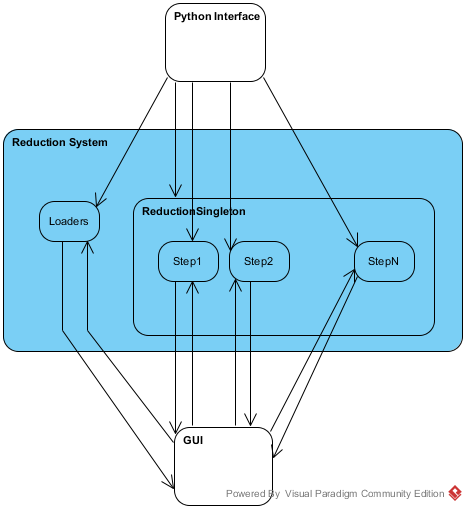

# User Requirements Document for ISIS SANS Backend Rewrite

This document is intended to collect the requirements which are associated with
MantidProject issue [#15875](https://github.com/mantidproject/mantid/issues/15875).

The intention of the issue is to replace the organically grown and now difficult to
maintain back-end of the ISIS SANS reduction work-flow.

### Scope of this document

This document covers the functionality of a new reduction back-end for ISIS SANS.
It tries to capture the needs of the ISIS facility scientists. The requirements
should describe a first version of this new back-end. New functional features are
avoided, while non-functional requirements such as performance-constraints are
captured here-within.

### Definition of terms

| Term  | Definition|
|------|------------|
|GUI   | Graphical User Interface|
| PI   | Python Interface |

## General description

The rewrite of the ISIS SANS reduction back-end should affect the entire reduction ecosystem, including the actual reduction code, the loaders, the interfacing to Python and the interfacing to the GUI.

The main functional capabilities of the system will be equivalent to the current system. Focus is on creating an performance-improved, maintainable  
The focus is to make the reduction system:
* maintainable by defining clear units of work which can be understood and tested individually.
* performance-improved by reusing existing data and having a parallelizable batch modes operation.
* extensible by keeping instrument-dependent information out of the reduction system and allowing for easy reconfiguration of the reduction system.

### System Context

#### New System Context

The new reduction system will interact with the GUI and the PI via a defined
user interface communication. The GUI and the PI remain agnostic regarding the
the reduction internals. The internals themselves will not contain intra-dependencies and only rely on the state which is passed into the reduction system.

#### Current System Context

The current system interacts directly with the implementation of the reduction system. This design lead to a system which is hard to maintain and test.

## Requirements

##### Necessity

* M : Mandatory
* D : Desirable
* O : Optional

The "Desirable" necessity is something which might not get addressed in the
the very first iteration of the the implementation, but should eventually be
provided.

#### Functional requirements

| Label  | Requirement    |   Necessity |
|--------|----------------|-------------|
| R.1.1  | Has same configurational capability as the previous system | M |
| R.1.2  | Interfaces with existing Python scripting | M |
| R.1.3  | Interfaces with beam center finder | M |
| R.1.4  | Runs with histogram and event mode data as well as added data files | M|

#### Design and Implementation constraints

| Label  | Requirement    |   Necessity |
|--------|----------------|-------------|
| R.2.1  | Should create a few work-flow algorithms (that may call others) to perform the ISIS SANS data reduction (Nick Draper) | M|
| R.2.2. | It should share as much as possible (or be the same as) the ANSTO codes.(Nick Draper)  |  D|
| R.2.3 | his should be done separately from the current GUI and back-end, which will remain in place until we are ready to replace it. (Nick Draper) | M |
|R.2.4 |  Batch processing should be considered first, and single run processing only as a special case of batch processing (this affects the GUI more than the script). | M|
| R.2.5 | Should be possible to extend to other facilities | M/D|

### Non-functional requirements

| Label  | Requirement    |   Necessity |
|--------|----------------|-------------|
| R.3.1  | Should avoid reloading, already existing workspaces (all) | M |
| R.3.2  | Should be parallel where possible | D |
| R.3.3  | Should avoid converting to event-mode data to histogram data as long as possible (Nick Draper)| M|
| R.3.4 | Should make use of reduced can workspace where applicable (Richard) | D|
| R.3.5 | Users should be able to load the data workspace with an instrument movment applied to it, in order inspect the positioning of the detector banks (Richard) | M |
