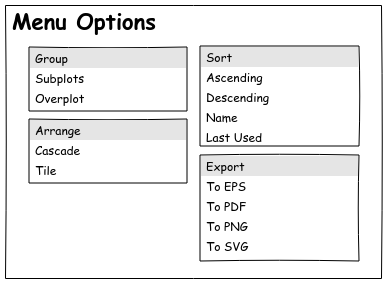

# Plot Selector Widget

## Requirements

The request from the January 2018 user meeting was to have a widget that allowed easy switching between plots, in particular for SANS and Reflectometry users. Another request from the ILL was to have a method to easily arrange the plots.

For consistency the design should follow as closely as possible similar functionality in Mantid, such as the workspace selector and plotting options within the workspace selector.

## Functional Design

### Interface Design

For consistency the plot selector widget should follow a similar design to the workspace selector. Double-clicking a plot name will bring the plot to the foreground and make it the active one.

**All plots created from the workbench are shown in the list.** The name shown will be the figure window title. Double-clicking a plot will bring it to the foreground. Filtering works as for the workspace selector. Close can act on one or more selected plots. Additionally plots can be closed individually by clicking the close button on one of the plots in the list.

**This figure shows the menu options for Group, Arrange, Sort and Export.** Group allows figures to be grouped, either as a set of subplots in a single figure or over-plotted in a single figure. Arrange allows all plot windows to be cascaded or tiled. Sort allows sorting by name or last modified, ascending or descending. Export allows all selected plots to be exported to commonly used file types.

**Selecting a new plot will then prompt for which workspace to plot, and offer advanced plotting options.** Selecting multiple workspaces should give the same behaviour as selecting multiple workspaces in the workspace selection widget (e.g. same plot for 1D, side-by-side for 2D). The advancded plot options should follow those in the current MantidPlot.

**Right-clicking on the plot name will bring up a menu with some options.** The options are to bring the plot to the front, rename it, export the plot or close the plot.

### Priorities for Implementation

Essential for workbench prototype:

* List of plots
* Double-clicking a plot brings it to the foreground and makes it active
* Right-click gives the option to bring the plot to the foreground and make it active
* Filtering plots based on name (for consistency behaviour should be the same as the workspace widget - filtering based on any sub-string)

Nice to have:

* Selecting one or more plots and clicking close closes selected plots
* Right-click menu option to close plots
* Use delete key to close one or more plots
* Plots can be closed by clicking the X next to a plot name
* Right-click menu option to rename plot
* Option to sort by either name or last accessed plot, ascending or descending
* Export to export plots a useful subset of supported types
* Right-click menu to export plot
* New option to create a plot from the plot selector
* Arrange option to tile or cascade the current open plots (this could be investigated further to see if anything nicer can be done here to arrange the plots)

Ideas for the future:

* Mini-plot next to the plot name (a la LAMP)
* Plot preview when hovering over the plot name
* Details of the plot as for the workspace selector

## Technical Design

The design should follow the model-view(widget)-presenter design used elsewhere in the new workbench - see [workbench architechtural design](../design-arch.md).

### Access to Plots

Access to a list of figures can be obtained from `qt/applications/workbench/workbench/plotting/currentfigure.py`. This code was initially used to provide the hold/active functionality which is to be removed. Some form of observer pattern will be required to update the plot selector list when new plots are made, so for now this class should be preserved to allow this functionality. This covers all plots created in the workbench, including those directly created in matplotlib.

To get easy access to the plots the initial implementation will be in the workbench, under a new widgets directory - `qt/applications/workbench/workbench/widgets`. If there are no technical barriers this could eventually be moved into the directory containing the standalone widgets.

### Last Accessed

There does not seem to be anyway in matplotlib to know when a plot was accessed or modified. The last time the plot was active could potentially be tracked in the the `CurrentFigure` class.

