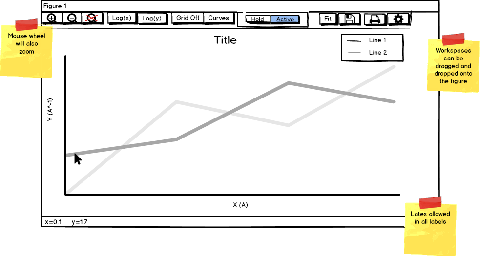
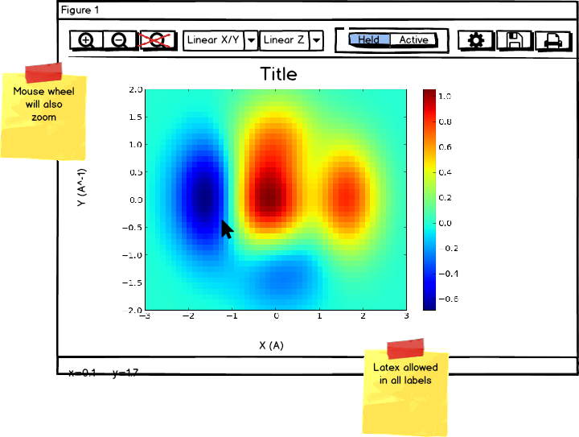

Summary
=======

This document describes the architecture of the new workbench. It includes the intended design for the `mantdidui` package.

For reference the overall layout mockup is shown here:

The central widget will be a tabbed-widget that will not be movable and 1 tab will be reserved for the embedded IPython console. It should be possible to drag an individual tab out of the window to be displayed on another monitor, for example.

- **Question: Where should the controls for script execution go? I would suggest just on the main menu, with appropriate shortcuts set.**

Automated Testing
=================

One of the most common complaints about the existing MantidPlot application is stability. We must take a proactive approach to automated testing within the new workbench. Where possible we will use common patterns such as
[MVP][mvp-fowler] to facilitate automated testing of the GUI elements and provide a better seperation of concerns within the code.

For existing code and code that would possibly be rendered more difficult to work with using MVP then the suggestion would be to supplement the pattern approach with testing via the [Qt Test][qttest] library. It allows
unit testing of Qt applications and libraries. Particularly for our existing interface/widget code this would provide some sort of automated testing that is currently lacking. This seems to be used quite successfully within
the [Jupyter Qt Console][jupyter-qtconsole], for example.

Widgets
=======

The intention is that the workbench be comprised, as much as possible and sensible, of reusable widgets. These widgets will live in a new `mantidqt.widgets` subpackage (see [layout](design-layout.md) for it's layout within the rest of the source code). Other packages should be able reuse these widgets so they must not make an assumption about their running environment.

The current list of widgets contained within the existing [widgets][mantidwidgets] library will be resued where appropriate. Some more commonly used widgets shall be supplemeted with tests using the Qt Test framework rather than
writing them from scratch. A notable exception to this list would be the new variable explorer. As this is significantly different to the current workspace list view it would be better implemented from scratch.

Plotting
========

`matplotlib` will provide the plotting abilities within the new workbench. It exposes all classes as an object-oriented API but also provides a procedural, state-machine api, `pyplot`, that is particularly convenient for
interactive programming. The OO api will be used internally by the workbench but users will be most likely want to interact with simpler the `pyplot` api more frequently.

In `pyplot` matplotlib provides a default window/toolbar that provides basic tools. This will be inadequate for our users so we will develop a custom toolbar for our the 1D, 2D and 3D plot types.

#### 1D Plots

#### 2D Plots

These figures are meant to serve as a guide and will need to be tweaked as they are developed.

### Figure Management

It is desirable within the plotting framework to have a mechanism for controlling how figures are managed. For example, when `plot` is called without specifying a window then we must make a choice of either:

 - create a new figure or
 - merge/overplot with an existing figure.

The initial propsosal is to borrow ideas from the [mslice][mslice] and have a controls on the figures so that users can indicate what is to be done with this window. In the figures above each figure contains a pair of
buttons `Hold/Active` or `Held/Active` (depending on its state). These buttons control what happens when a plotting function is called without explicit intent as to which figure it should affect.

- Hold: This window should be *frozen* and left as it is. Further plotting should be done in a new window. The text of the button changes to *Held* and the background colour to *red*.
- Active: This window is the *active* window for this plot type (separate lists maintained for 1D, 2D, 3D). Further plotting will **replace** the contents of this window. The  background colour to Active goes to  *green* and the `Held/Hold` button text is set back to *Hold* and it sbackground back to gray.

The default state for new windows, i.e. whether held or active will be user configurable.

Coding Style
============

It is proposed we introduce a new Python style guide for Mantid. All new and refactored code should then follow this guide. The [IPython style guide][ipython-style] offers quite nice guidelines and it is suggested that we
follow these guidelines where applicable, including a template file for new code that could be used in the `class_maker` to generate new files.

Static Analysis
===============

We will no longer be able to rely on a compiler to catch simply errors - it is therefore imperative that we use static analysis to its fullest extent. While `flake8` is good it is not as thorough as `pylint` and given our
target is maximum reliability I propose that, at least on the gui components, we reinstate `pylint` for each pull request. Its configuration should be updated to remove some warnings that are too pedantic. As we are
starting from a clean slate with the workbench it should not be an issue to keep the warning level at 0. Special care should be taken by reviewers to assess when any warnings are suppressed to check if this is indeed valid.

<!-- Links -->
[mvp-fowler]: https://www.martinfowler.com/eaaDev/PassiveScreen.html
[qttest]: http://doc.qt.io/qt-5/qttest-index.html
[jupyter-qtconsole]: https://github.com/jupyter/qtconsole/blob/master/qtconsole/tests/test_console_widget.py
[mantidwidgets]: https://github.com/mantidproject/mantid/tree/master/MantidQt/MantidWidgets
[mslice]: https://github.com/mantidproject/mslice
[ipython-style]: https://github.com/ipython/ipython/wiki/Dev:-Coding-style
