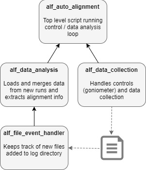

# Automated Alignment on ALF

This document contains information on the automated alignment project for ALF. The idea is to have a script that runs a data collection / data analysis loop, that automatically collects and analyses scans of a sample at different rotations until there is enough information to calculate a UB matrix, which informs the correct alignment of the sample.
This is done by way of [this Python application](linky) comprising the following elements:

As of the moment, the script returns a UB matrix for the input dataset, but does not yet use this information to align the sample. As such, this is more of a starting point than a finished product. It has only been tested with a simulated instrument (i.e. not using an actual goniometer or collecting any data), thus the `genie_python` portion of the application will probably need some tweaking.

Following are instructions on how to set up and run the auto alignment script.

## Parameters

There are a number of parameters that will differ from run to run and need to be set in the top level script (eventually this should be done via GUI)

#### Data collection parameters
- `simulate`: Sets whether you are using a real or simulated instrument. If set to `True`, the rotation value will just be written to an arbitrary pv and no actual data collection is performed. You can simulate the writing of run data by copying pre-existing runs into the directory watched by the file watcher. If set to `False`, the script will attempt to rotate the sample and collect data on ALF. **(THIS HAS NOT YET BEEN TESTED)**
- `rotation_initial`: The initial sample rotation where the scan should start.
- `rotation_step`: How many degrees to rotate the sample between runs.
- `run_length`: Duration of data collection for each run.

#### Data analysis parameters

Peakfinding parameters:
- `mask_dspace_min`/ `mask_dspace_max`: Data in this d-spacing range will be masked - this is used to filter out noise from the sample holder. Depends on the material of the sample holder.
- `background`: Threshold for what is considered a peak. Anything with a lower intensity is considered background and thus discarded.
- `resolution_tof`: The time-of-flight resolution. Describes the minimum difference in time-of-flight between two peaks for them to be considered distinct.
- `resolution_phi`: The phi resolution. Describes the minimum horizontal angle between two peaks for them to be considered distinct.
- `resolution_phi`: The two theta resolution. Describes the minimum vertical angle between two peaks for them to be considered distinct.
- `merge_tolerance`: Minimum distance in Q for two peaks to be considered distinct. Removes duplicates when merging peaks from different (overlapping) runs.

Lattice parameters of the sample 
- `a`, `b`, `c`, `alpha`, `beta`, `gamma`. These values are passed to the `FindUBUsingLatticeParameters` algorithm. Generally, the users should know these values for their sample.

## Setup

To run the data collection / data analysis control loop, the application needs both the `MantidPython` and `Genie_Python` libraries. One way to achieve this is to bundle `genie_python` with the Mantid installation:

1. Update genie python on the machine by running 
  `\\isis\inst$\Kits$\External\BuildServer(ndwvegas)\genie_python\genie_python_install.bat`
2. Run [configure_mantid_genie.bat](resources/configure_mantid_genie.bat)
  This moves genie_python and its dependencies to the mantid-install folder. (Check that the paths in the script are correct)
3. Install the `watchdog` module. (Instructions [here](http://pythonhosted.org/watchdog/installation.html)).
  This is used to monitor the file system for new data to be analyzed after a run has been conducted.
4. Move the [Script](linky) to `\scripts\ALF_auto_alignment\`
  
After this is done, you should be able to run the alignment script by calling it with the `mantidpython.bat` in the Mantid-install folder, i.e.:

`> C:\Mantid-install\bin\mantidpython.bat --classic .\scripts\ALF_auto_alignment\alf_auto_alignment.py`

## Example

The data set this has been tested with throughout development is comprised of ALF runs `75243` - `75264`.
You can test the script by running it with the following parameters:
- `simulate = True`
- `lattice_a = 3.82`
- `lattice_b = 3.82`
- `lattice_c = 6.28`
- `mask_dspace_min = 0`
- `mask_dspace_max = 2.6`
- `background = 50`
- `resolution_tof = 5000`
- `resolution_phi = 10`
- `resolution_th2 = 10`
- `merge_tolerance = 1`

Then just copy the run data files into the watched directory while the script is running. You can drop them one by one after each "collection" cycle to simulate what would happen in a live scenario, or all at once to just check the result. The UB matrix will be saved in `[watched directory]\log\UB_[last processed run].txt`

## TODO LIST:
The script is a work in progress and possibly not very useful in its current form. Here is a To-Do list of essential tasks:
- Translate the UB matrix into instructions on how to actually align the sample
- Implement functionality for predicting the positions of further peaks once two have been found. By jumping to the predicted position for the next scan, we can both cut the time the script takes to complete, and confirm (or refute) the UB matrix derived from the first two peaks.
- Script robustness: At the moment it is difficult to diagnose the quality of the results the script is delivering while it is running. As it is easy to screw up the results with parameters that are subtly wrong, this could turn the script into a big waste of time for the users. To mitigate this: 
  - There should be a way to assess the correctness of the results while it is running, e.g. using confidence metrics for the UB matrix such as error, number of indexed peaks, level of change between iterations... 
   - Think of ways to guide the setup, e.g. presets for the d-spacing mask based on the material of the sample holder
   This should be tested extensively with different datasets. 
 
Regardless, it is probably also a good idea for the users to perform a run before running the script to get an idea of the background intensity.
