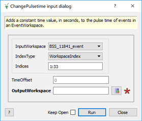
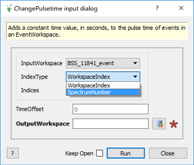

In addition to addressing algorithm name violations and inconsistencies, we have also been looking into algorithm properties. Proposed changes can be listed under four categories:

1. Naming Violations and Inconsistencies
	- Some property names go against naming conventions. Rules are in place which define casing (camel case), first letter capitalization and illegal characters.
	- Some algorithm property names are inconsistently defined. For example, `WavelengthMin vs MinWavelength`, `StartWorkspaceIndex vs StartIndex`, `Xmin vs MinX`, `Filename vs FileName`.
2. InOut workspaces 
	- InOut workspaces are unecessary and produce inconsistency in the way algorithms are defined
	- Some algorithms have separate input and output workspaces. 
	- The InOut mechanism for workspaces is no longer advantages, this functionality of overwriting the input workspace can be achieved without using InOut workspaces.
	- Heavily used algorithms which will be affected: LoadInstrument, MaskDetectors, AddSampleLog, GetEi, AddPeak.
3. Hidden Properties
	- There are some algorithms which create output properties during execution. This practice should be abandoned as it increases the difficulty of maintining/verifying standards for property naming. Examples include FilterEvents and RefReduction. Properties could be set to optional and set depending on chosen execution path.
4. Index confusion
	- There is currently a lot of confusion with the number of ways to define indexing into workspaces and how users can input these index types. Currently used terms include WorkspaceIndex, SpectrumIndex, SpectrumNumber, DetectorID and DetectorIndex. 
	- A new proposed property type `WorkspacePropertyWithIndex` seeks to create a consistent interface for handling indices.
	- Client code will be better able to define and retrieve indices as a part of this property.
	- Using this property in python will take on the following form:
	```python
	#Spectrum Numbers
	outWs = ChangePulsetime("BSS_11841_event", InputWorkspaceSpectra="1:33", TimeOffset=10)
	#Workspace Indices
	outWs = ChangePulsetime("BSS_11841_event", InputWorkspaceIndices="0:55,80,81", TimeOffset=10)
	#Detector IDs
	outWs = ChangePulsetime("BSS_11841_event", InputWorkspaceIDs="1002,1004:1009", TimeOffset=10)
	```
	- Users will be presented with the following when running the algorithm using the UI. Notice the user may select the desired index type based on the allowed input index types specified by the algorithm author:
	
 

