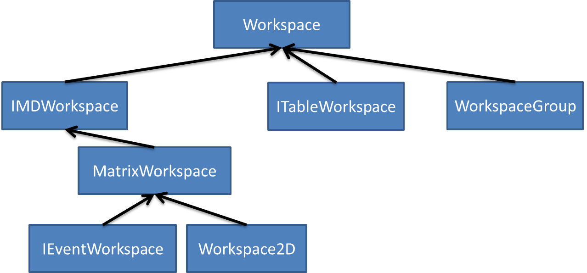

# FitPeaks

## The algorithms to do peak fitting in Mantid

* [Fit](http://docs.mantidproject.org/nightly/algorithms/Fit-v1.html)
* [FitPeak](http://docs.mantidproject.org/nightly/algorithms/FitPeak-v1.html)
* [FindPeaks](http://docs.mantidproject.org/nightly/algorithms/FindPeaks-v1.html)
* MantidPlot fitting UI

### A brief history

* Long long time ago...
** Fit
** FindPeaks
*** Finding peaks by fitting peaks in the given location;
*** Using Mariscotti algorithm to *observe* peaks; Fitting peaks that are *observed*


## First place to look: [Concept Pages](http://docs.mantidproject.org/nightly/concepts/WorkspaceGroup.html).

Documentation says:
> A WorkspaceGroup is a group of workspaces.

Gives information on:
* grouping
* un-grouping
* expected behaviour in algorihtms

##### Creating a WorkspaceGroup
```Python
wsGroup = GroupWorkspaces([ws1, ws2, ws3])
wsGroup = GroupWorkspaces("ws1,ws2,ws3")
```

##### Un-grouping workspaces
```Python
UnGroupWorkspace(wsGroup)
# This only removes the grouping. The child workspaces are still preserved.
```


## WorkspaceGroup in the workspace taxonomy

Is a collection of arbitrary workspaces:


This means that cannot provide a lot of functionality:



#### Some WorkspaceGroup methods in C++

```Cpp
void addWorkspace (Workspace_sptr workspace);
void removeItem (const size_t index);
bool isEmpty () const;

...

void add (const std::string &wsName);
void remove (const std::string &wsName);
std::vector<std::string> getNames () const;
```

Direct exposure to ADS!!! (but also methods for non-ADS operations)

From `WorkspaceGroup.h`
> Class to hold a set of workspaces. The workspace group can be an entry in the AnalysisDataService.
    Its constituent workspaces should also have individual ADS entries.
    Workspace groups can be used in algorithms in the same way as single
   workspaces.

#### Some WorkspaceGroup methods in Python

 ```Python
remove((WorkspaceGroup)self, (str)workspace_name) -> None
add((WorkspaceGroup)self, (str)workspace_name) -> None
...
```

Intrinsically built to work with the ADS!


## Interplay with ADS (Python)

Grouping and Ungrouping see above.

#### Adding and removing

*Only* via a name:
```Python
ws1 = CreateSampleWorkspace()
ws2 = CreateSampleWorkspace()
group = GroupWorkspaces([ws1])
group.add("ws2")
group.remove("ws1")
```

e.g.:
```python
ws3 = CreateSampleWorkspace()
group.add(ws3)
```
not exposed yet.

*NB:* Removing a WorkspaceGroup using the ADS does not delete the child workspaces
```python
#Create group workspace with ws1 and ws2
group = GroupWorkspace([ws1, ws2])

#Removing group using an ADS call deletes the group
#but not the workspaces.
mtd.remove("group")
```

#### Orphaned workspaces

Sub-workspaces can become orphaned on the ADS. 
``` Python
CreateSampleWorkspace(OutputWorkspace='alice')
CreateSampleWorkspace(OutputWorkspace='bob')
CreateSampleWorkspace(OutputWorkspace='charles')
GroupWorkspaces(InputWorkspaces='alice,bob,charles', OutputWorkspace='NewGroup')
# .....
GroupWorkspaces(InputWorkspaces='alice,bob', OutputWorkspace='NewGroup')
```
Have to delete the old group workspace first!

#### Two references to the same object on the ADS
```Python
ws1 = CreateSampleWorkspace()
ws2 = CreateSampleWorkspace()
group = GroupWorkspaces([ws1, ws2])
new_name = RenameWorkspace(group.getItem(0))

cloned = group.clone()
new_name = RenameWorkspace(cloned.getItem(0))
```
```Python
dataX = [0, 2, 4, 6, 8, 10, 12, 14]
dataY = [98, 30, 10, 2, 1, 1, 1]

ws1 = CreateWorkspace(dataX, dataY)
ws2 = CloneWorkspace(ws1)
ws3 = Multiply(ws1, ws2)

#Groups share ws1
group = GroupWorkspaces([ws1, ws2])
group2 = GroupWorkspaces([ws1, ws3])

#This will delete workspace 1
DeleteWorkspace(group2)
```
#### `WorkspaceGroup` outside of the ADS

Does not seem possible purely within Python as `GroupWorkspaces` uses the `ADSValidator` on the `InputWorkspaces` field, but can have "invisible" WorkspaceGroup via loading:
```python
file_path = "C:/Users/pica/Desktop/WorkspaceGroup.nxs"
alg = AlgorithmManager.createUnmanaged("Load")
alg.initialize()
alg.setChild(True)
alg.setProperty("Filename", file_path)
alg.setProperty("OutputWorkspace", "dummy")
alg.execute()
ws = alg.getProperty("OutputWorkspace").value
print("The workspace is of type {} and contains {} elements".format(type(ws), len(ws)))
print("Number of workspaces on ADS is {}".format(len(mtd.getObjectNames())))
```

Workspace on ADS, but group workspace does not have to be
```python
ws1 = CreateSampleWorkspace()
ws2 = CreateSampleWorkspace()

group_alg = AlgorithmManager.create("GroupWorkspaces")
group_alg.setChild(True)
group_alg.initialize()
group_alg.setProperty("InputWorkspaces", [ws1, ws2])
group_alg.setProperty("OutputWorkspace", "test")
group_alg.execute()

group_ws = group_alg.getProperty("OutputWorkspace").value
print "The group workspace has a size of {}.".format(len(group_ws))

```


## Using WorkspaceGroups in Algorithms
* Algorithms which accept Workspaces properties which are not groups may in some cases still run with WorkspaceGroups. The result will be the algorithm being executed on each workspace in the group in turn.
```python
dataX = [0, 2, 4, 6, 8, 10, 12, 14]
dataY = [98, 30, 10, 2, 1, 1, 1]

ws1 = CreateWorkspace(dataX, dataY)
ws2 = CloneWorkspace(ws1)

group = GroupWorkspaces([ws1, ws2])


ouput = Rebin(group, 1)


print type(ouput)
```
* Algorithms which accept WorkspaceGroup specifically will not work if the wrong workspace type is passed e.g PolarizationCorrection.
```python
dataX = [0, 2, 4, 6, 8, 10, 12, 14]
dataY = [98, 30, 10, 2, 1, 1, 1]

ws = CreateWorkspace(dataX, dataY)

output = PolarizationCorrection(ws) #ValueError
```


